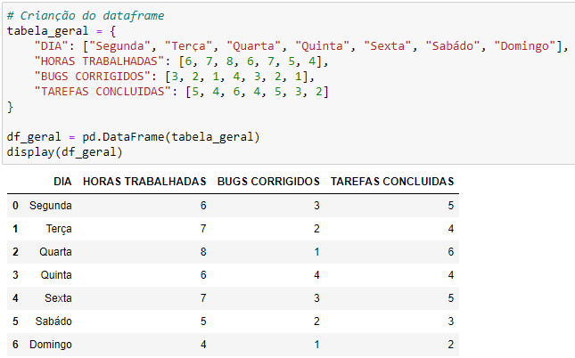

# Projeto Individual Módulo 4 - RESILIA

## Objetivo 🎯
 Este relatório tem o objetivo de demonstrar a importância da análise dos dados de um projeto de desenvolvimento de software ao longo de uma semana. 

 Gerar um relatório de progresso diário para mostrar o quão produtivo está sendo o
trabalho dos funcionários e incluir no relatório outros itens como:
- Total de Horas Trabalhadas
- Média Diária de Horas Trabalhadas
- Total de Bugs Corrigidos
- Média Diária de Bugs Corrigidos
- Total de Tarefas Concluídas
- Média Diária de Tarefas Concluídas
- Produtividade Diária (Tarefas Concluídas por Hora)

## Criação do DataFrame ⬇️
*Este é o DataFrame ultilizado para responder os itens citado acima.*

## Criação de gráficos
*Também foi ultilizado gráfico para tornar visual as questões apresentadas nos tópicos acima*

*Este gráfico é resultado de uma comparação do DataFrame mostrado acima, com outros dois Datasets carregados apartir de um arquivo .csv*

## Tecnologias Utilizadas 💻

   

 
 

